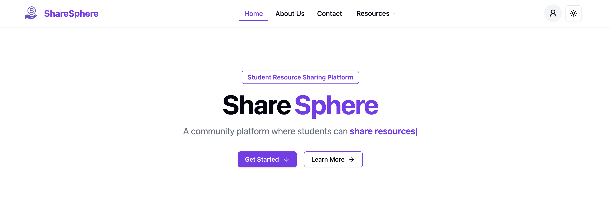
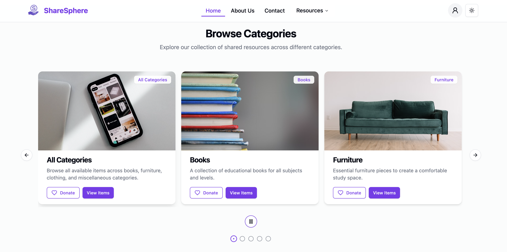
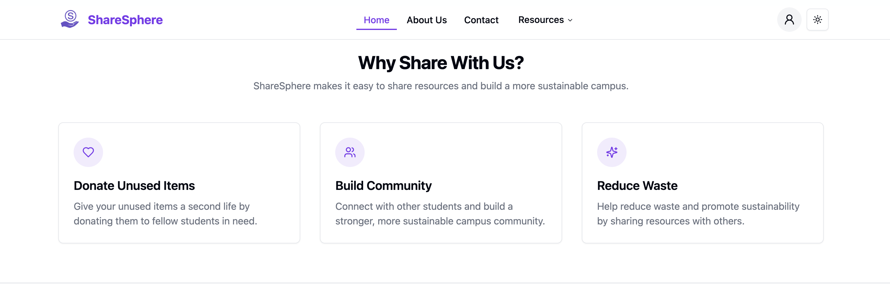

  

    
    <h1 style="margin: 0;">ShareSphere</h1>
  

  
<em>A campus community platform to share books, clothes, and essentials – reducing waste while helping each other thrive</em>

---

## Overview

**ShareSphere** is a modern web application designed to facilitate seamless sharing and collaboration among students. Our platform enables students to share books, clothing, furniture, and other items they no longer need, reducing waste and helping others save money while building a stronger campus community.

## Screenshots

### Homepage

  

### Browse Categories

  

### Why Share With Us

  

## Features

- **Secure Authentication**: User login and registration system using Passport.js
- **Resource Sharing**: Upload and share items like books, clothing, furniture, and more
- **Real-time Collaboration**: Work together with other users in real-time
- **Responsive Design**: Fully responsive interface that works on desktop and mobile devices
- **PostgreSQL Database**: Robust data storage and retrieval
- **RESTful API**: Well-structured API for frontend-backend communication
- **Cloud Storage**: Secure file storage with Cloudinary
- **Email Integration**: Automated email notifications with Nodemailer

## Tech Stack

### Frontend

  
  
  
  
  

- **React.js** - Component-based UI library
- **Vite** - Fast development and optimized builds
- **TailwindCSS** - Utility-first CSS framework
- **shadcn/ui** - Reusable UI components
- **Axios** - HTTP client for API requests

### Backend

  
  
  
  
  

- **Node.js** - JavaScript runtime environment
- **Express.js** - Web application framework
- **Express-session** - Session handling middleware
- **PostgreSQL** - Relational database management system
- **Passport.js** - Authentication middleware
- **Cloudinary** - Cloud-based image and video management
- **Nodemailer** - Email sending functionality
- **CORS** - Cross-origin resource sharing
- **Multer** - File upload handling

## Contributors

  

    <a href="https://github.com/Nkhanal2002" target="_blank" style="text-decoration: none; color: inherit;">
      
      <h5 style="margin: 10px 0 5px;">Narayan Khanal</h3>
      
Frontend Developer

    </a>
  

  

    <a href="https://github.com/EDe-Graft" target="_blank" style="text-decoration: none; color: inherit;">
      
      <h5 style="margin: 10px 0 5px;">Edward De-Graft Quansah</h3>
      
Backend Developer

    </a>
  

 

If you have any questions, please contact us at sharesphereapp@gmail.com.

---

  
Made with ❤️ by the ShareSphere Team

  

    <a href="#top">Back to top</a>
  

